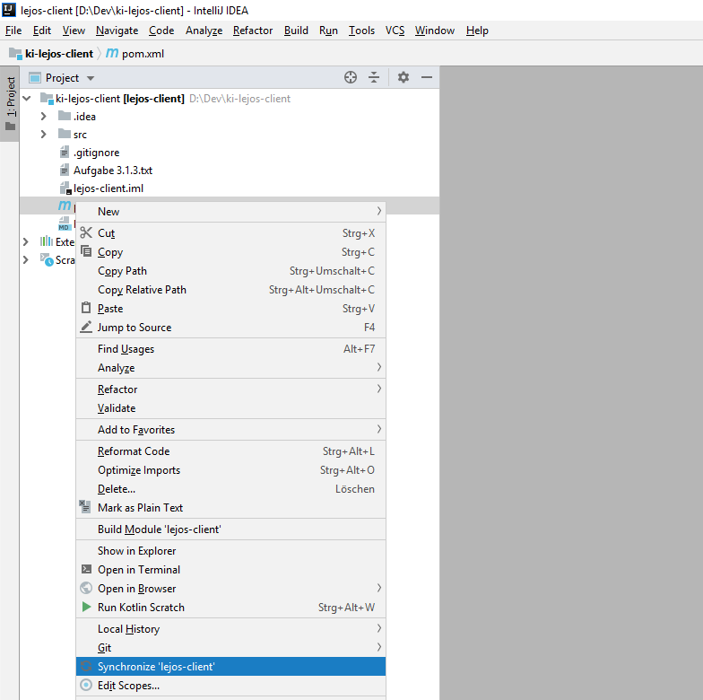
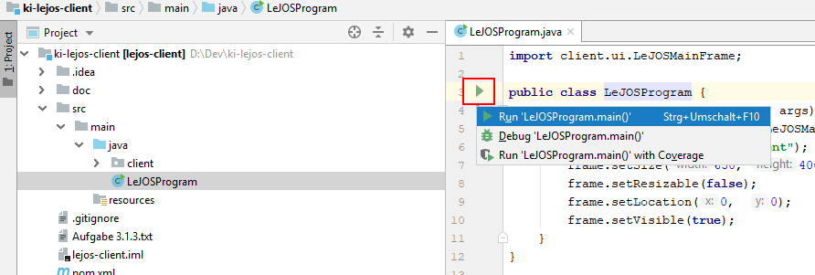
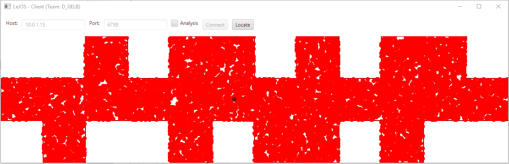
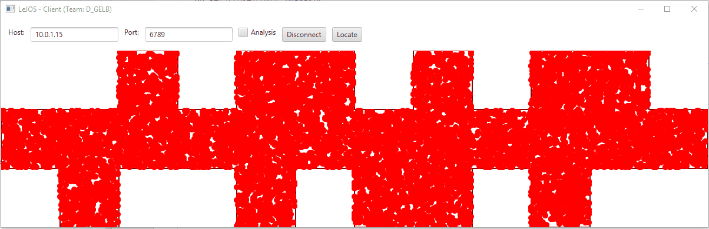

# ki-lejos-client
Das ist die Client-Anwendung für unsere LeJOS-Anwendung. Der Client kommuniziert über den TCP-Port 6789 mit dem Teil der Anwendung auf dem LeJOS.  Der Teil der auf dem LeJOS läuft ist unter https://github.com/mbiesenb/ki-lejos zu finden.

# Downloaden und Einrichten

## 1. Repository clonen
```bash
git clone https://github.com/rudolfgrauberger/ki-lejos-client.git
```

## 2. Das ausgecheckte Verzeichnis in IntelliJ **Öffnen**

## 3. Ggf. Maven manuell synchroniseren

*Hinweis:* Es kann vorkommen, dass IntelliJ nicht direkt nach dem Öffnen damit anfängt die Maven-Abhängigkeiten zu aktualiseren, dann das Synchronisieren manuell anstoßen.



## 4. Konfiguration anlegen

Einmal zu der Main.java-Datei navigieren und wie im Screenshot einmal das Ausführen.



Anschließend erscheint automatisch die Konfiguration (vgl. 1) und man kann wie gewohnt über die Schaltflächen (vgl. 2) das Programm ausführen oder Debuggen.


# Ausführen
Bei dem Client haben wir die zwei Modi implementiert:
- Roboter
- Simulation

Die Simulation war besonders am Anfang, also beim Verständnis der Monte Carlo Lokalisation und bei den Berechnungen, sehr hilfreich. Anschließend mussten wir für den Roboter noch einige Anpassungen vornehmen, da die Sensoren hin und wieder falsche Werte zurückgeliefert haben. 

## Simulation

```java
public static boolean SIMULATE_MODE = true;
```

Hierbei wird an einer zufälligen Position in der Karte ein "Roboter" als grüner Punkt eingezeichnet. Außerdem werden die Steuer-Elemente zum Verbinden mit unserem Roboter abgeblendet.

So sieht die Simulation aus:


## Lokalisierung mit dem Roboter

```java
public static boolean SIMULATE_MODE = false;
```

So sieht es es Client dann aus (leider kein Video, wie der Roboter sich tatsächlich dazu in der Welt bewegt hat)
